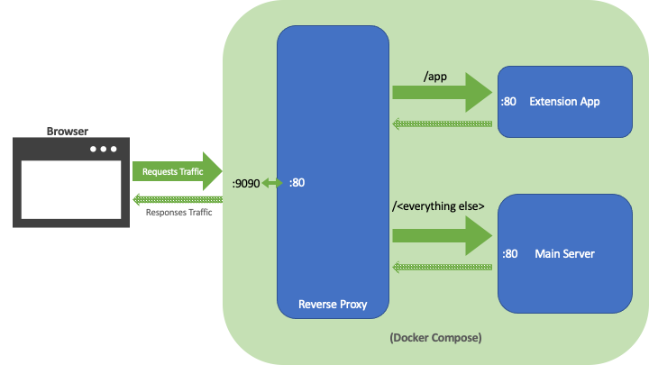

# Reverse Proxy Demo

Starting the demo:
> docker-compose up --build

You should eventually get the container logs:

This will deploy 3 containers:
- reverse_proxy (accessible through port 9090)
- server_main
- server_app

So when calling http://localhost:9090 all the traffic gets directed to the main server,
except when the URL starts with "/app", in which case it gets directed to the "Extension App" server:

- http://localhost:9090/index.html displays "main server"
- http://localhost:9090/app displays "app server"

Docker-compose is configured in a way that both the main and extension servers are directly accessible 
from a browser through ports 8081 and 8082, respectively.

Stopping the demo:
> docker-compose down
